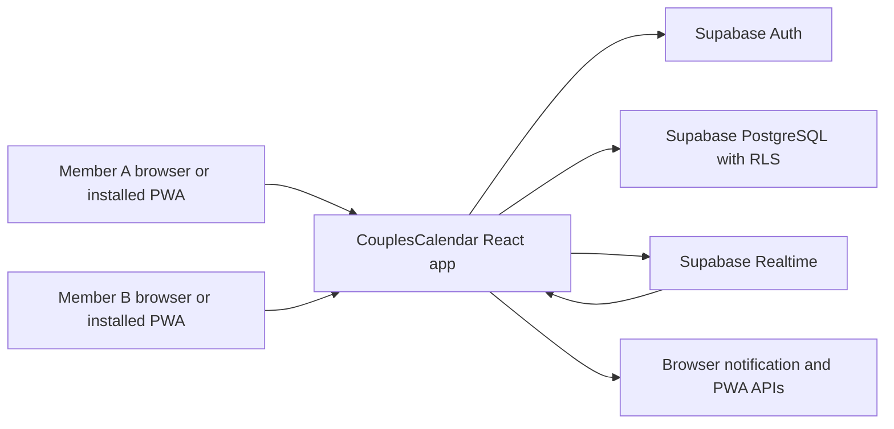
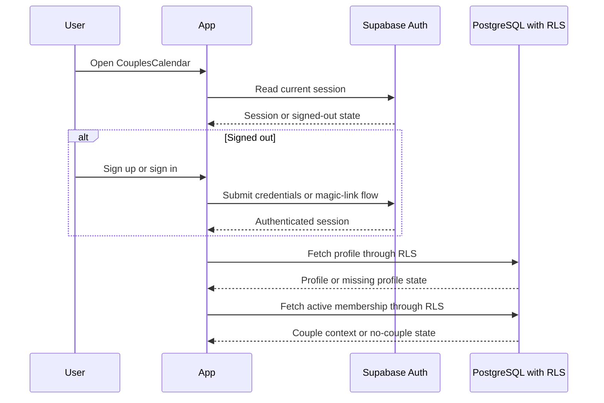
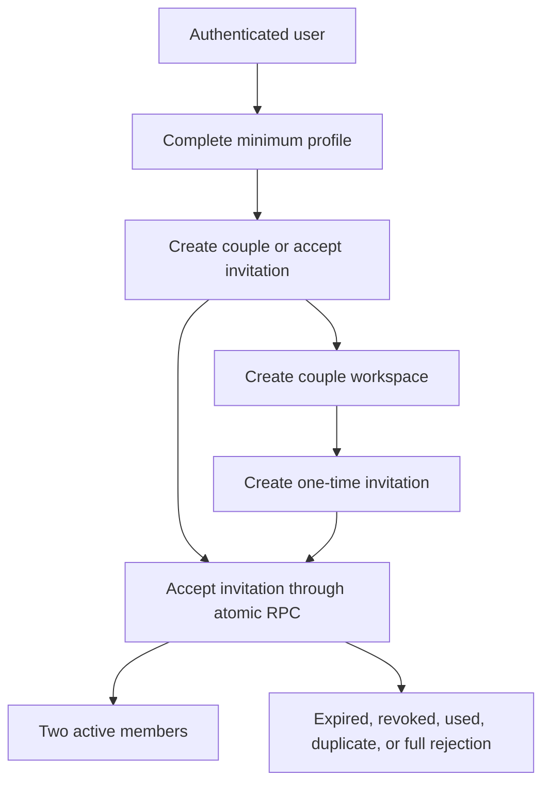
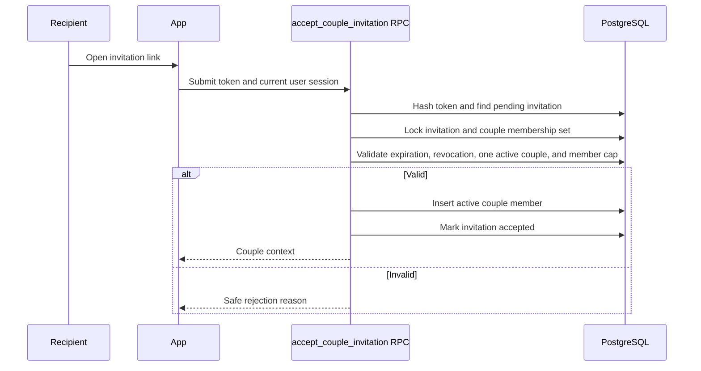
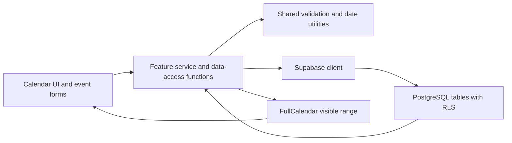
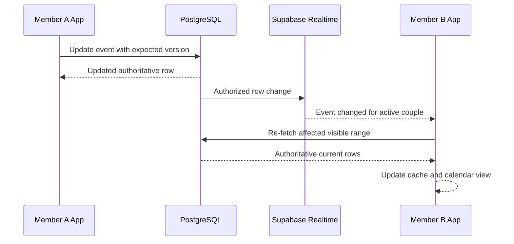

# CouplesCalendar Architecture

## Purpose

This document defines the lightweight Phase 1 architecture for CouplesCalendar. It describes the
target architecture that later milestones must implement. Milestone 1 does not create runtime
modules, configure Supabase, add dependencies, or implement features.

## Approved Stack

- React.
- TypeScript.
- Vite.
- Tailwind CSS.
- FullCalendar.
- `vite-plugin-pwa`.
- Supabase Auth.
- Supabase PostgreSQL.
- Supabase Row Level Security.
- Supabase Realtime.

No FastAPI, Express, NestJS, serverless application layer, or custom application server is part of
Phase 1 unless a later owner-approved amendment changes the contract.

## System Context



CouplesCalendar is a browser-delivered PWA. The browser is not trusted with authorization decisions.
Supabase Auth establishes identity, and PostgreSQL Row Level Security is the authoritative
authorization boundary for couple data.

## Responsibility Boundaries

### Frontend

The React application is responsible for:

- Rendering mobile-first and MacBook layouts.
- Managing local UI state, form state, and validation feedback.
- Holding the Supabase Auth session through the browser-safe Supabase client.
- Calling narrow data-access functions instead of spreading raw Supabase queries through feature UI.
- Rendering FullCalendar views from normalized event occurrences.
- Subscribing to authorized Realtime channels for the active couple context.
- Showing offline, reconnecting, stale, loading, empty, conflict, and failure states.
- Requesting browser notification permission only after user intent.
- Installing and updating the PWA service worker after `vite-plugin-pwa` is introduced in the
  appropriate milestone.

### Supabase

Supabase is responsible for:

- Authentication and session issuance.
- Storing profiles, couples, memberships, invitations, events, categories, recurrence overrides,
  reminders, and notification preferences.
- Enforcing Row Level Security on every protected table.
- Enforcing database constraints such as two active members per couple, one active couple per user,
  event time validity, and invitation one-time use.
- Providing atomic invitation acceptance through a database function or transaction-safe RPC.
- Broadcasting authorized row changes through Supabase Realtime.

### Browser Trust Boundary

The browser can hold:

- Public `VITE_SUPABASE_URL`.
- Public `VITE_SUPABASE_ANON_KEY`.
- The authenticated user's session managed by Supabase client libraries.
- Non-secret UI state and safe cached application shell assets.

The browser must not hold:

- Supabase service-role keys.
- Invitation token plaintext after it is submitted for acceptance.
- Any assumption that a couple ID, user ID, or filter value from the client is trustworthy.
- Authenticated API responses in a cache that can be served across users.

## Authentication and Session Flow



Session handling uses Supabase Auth client behavior. The app reacts to auth state changes and clears
couple-specific UI state on sign-out.

## Onboarding and Invitation Flow



Invitation acceptance must be implemented as one transaction-safe database operation that:

- Hashes or compares the provided token without storing reusable plaintext secrets.
- Verifies the invitation is pending, unexpired, and unrevoked.
- Verifies the accepting user is authenticated, profile-complete, and not already in another active
  couple.
- Locks or otherwise serializes the target couple membership check.
- Inserts the second active member only if the couple has fewer than two active members.
- Marks the invitation accepted with `accepted_by` and `accepted_at`.

## Invitation Acceptance Sequence



The exact SQL is deferred to later milestones. The contract requires atomicity and database
enforcement.

## Calendar Data Flow



Calendar reads are scoped to the active couple and visible date range. Event series are expanded for
the visible range in application code or a later approved database helper, then normalized before
being passed to FullCalendar. RLS remains authoritative even when the client includes a couple ID.

Calendar writes go through feature services that:

- Validate date and timezone semantics.
- Validate recurrence syntax before storage.
- Include the event version or `updated_at` value for conflict detection on updates.
- Re-fetch the authoritative event after write success.
- Surface database rejection messages as safe UI states.

## Realtime Update Flow



Realtime subscriptions are scoped by authenticated session and active couple context. The app must
avoid duplicate subscriptions by centralizing subscription setup and teardown.

## Realtime and Conflict Strategy

- Subscribe only after an authenticated user has an active couple membership.
- Keep one active subscription group per couple context.
- Tear down subscriptions on sign-out, couple exit, or route changes that no longer need them.
- Treat Realtime payloads as invalidation hints. Re-fetch affected records or visible ranges when
  correctness matters.
- Maintain a local cache keyed by couple ID, visible range, and filters.
- Capture `version` or `updated_at` when an edit form opens.
- Update events with an optimistic concurrency predicate.
- If the predicate fails, show a conflict state with the latest authoritative event and options to
  cancel or retry from the latest version.
- On reconnect, discard stale assumptions and re-fetch active membership, preferences, categories,
  and visible calendar ranges.

## Offline and Reconnect Behavior

Phase 1 uses a deliberately limited offline model:

- The installed application shell may load offline after PWA support is introduced.
- Previously loaded information may be shown only when safely cached and labeled stale.
- Network-dependent writes are disabled or fail clearly while offline.
- The UI must not show an offline write as saved.
- There is no complex persistent offline mutation queue.
- There is no automatic multi-device conflict merger.
- Reconnection triggers authoritative revalidation from Supabase.

## Reminder and Notification Flow

- Notification preferences are stored per user and enforced by RLS.
- Event reminders are stored as data records scoped to a couple event.
- Browser notification permission is requested from a settings or reminder workflow after user
  intent.
- The frontend may schedule in-browser reminders only where browser capability and active/installed
  PWA state support it.
- In-app reminder indicators are acceptable for Phase 1 where browser notification delivery is not
  reliable.
- No custom application server, SMS provider, payment provider, or external calendar provider is
  introduced for reminders in Phase 1.

## PWA and Service Worker Boundary

`vite-plugin-pwa` is the approved PWA mechanism for a later milestone.

The service worker may cache:

- Static application shell assets.
- Versioned build assets.
- Public icons and manifest resources.

The service worker must not cache:

- Supabase Auth responses.
- Authenticated table or RPC responses.
- Invitation tokens.
- User-specific calendar payloads unless a later implementation explicitly adds a safe, per-user
  storage strategy with visible stale-state labeling.

## Error and Observability Approach

Phase 1 keeps observability lightweight:

- Use safe user-facing error messages that do not expose secrets, raw SQL, tokens, or policy details.
- Preserve useful developer diagnostics in local development.
- Treat validation failures as expected user states.
- Treat permission failures as security states, not generic failures.
- Log only redacted context if client-side logging is later added.
- Use validation scripts, tests, and CI as the primary quality signal until production
  infrastructure is approved.

## Environment Variables

Frontend environment variables must be browser-safe and prefixed for Vite:

- `VITE_SUPABASE_URL`.
- `VITE_SUPABASE_ANON_KEY`.

Never expose:

- Supabase service-role keys.
- Database passwords.
- JWT signing secrets.
- Provider secrets.
- Private API tokens.

`.env.example` documents required browser-safe variables. Real `.env` files remain untracked.

## Deployment Assumptions

Phase 1 assumes a static frontend deployment that can serve a Vite-built PWA and connect directly to
Supabase using the anon key plus authenticated sessions. Milestone 1 does not select, configure, or
deploy production infrastructure. Production deployment belongs to Milestone 11.

## Future Source Organization

Later milestones should keep source organization modular without enterprise-scale layering. The
target dependency direction is:

```text
app shell -> feature modules -> shared services -> Supabase data access
feature UI -> shared UI and utilities
shared utilities -> no feature imports
Supabase client -> no React imports
```

Feature components should not directly spread raw Supabase queries throughout the UI. They should
call feature services or hooks that use centralized data-access code.

### Intended Boundaries

| Boundary                             | Responsibility                                                                 | Must not own                                         |
| ------------------------------------ | ------------------------------------------------------------------------------ | ---------------------------------------------------- |
| Application shell and routing        | App frame, route guards, responsive layout, auth/couple bootstrapping.         | Feature-specific Supabase queries.                   |
| Authentication                       | Sign in, sign up, sign out, session listeners, auth-required states.           | Couple authorization rules.                          |
| Profiles                             | Profile setup, display name, default timezone.                                 | Couple membership limits.                            |
| Couple membership and invitations    | Couple creation, member status, invitation lifecycle, atomic acceptance calls. | Event rendering.                                     |
| Calendar views                       | FullCalendar integration, month and agenda presentation, visible range state.  | Raw event writes.                                    |
| Events                               | Event details, create/edit/delete workflows, conflict states.                  | Recurrence expansion internals beyond service calls. |
| Recurrence                           | RFC 5545 parsing, occurrence expansion, overrides, cancellations.              | UI navigation layout.                                |
| Categories                           | Couple-scoped category CRUD and color validation.                              | Notification preferences.                            |
| Search and filters                   | Search input, filter state, query composition.                                 | Authorization enforcement.                           |
| Realtime synchronization             | Subscription lifecycle, invalidation, reconnect revalidation.                  | RLS policy decisions.                                |
| Reminders and notifications          | Reminder data, permission UI, in-app/browser notification boundaries.          | SMS or server push delivery.                         |
| PWA and offline state                | Install prompt, service worker lifecycle, online/offline/stale indicators.     | Offline mutation queue.                              |
| Supabase client and data access      | Client initialization, typed query helpers, RPC wrappers, response mapping.    | React presentation components.                       |
| Shared validation and date utilities | Date, timezone, recurrence, color, and form validation helpers.                | Feature-specific UI state.                           |
| Reusable UI components               | Buttons, fields, dialogs, sheets, nav, status banners.                         | Data fetching side effects.                          |

## Architecture Acceptance Criteria

- The implemented app uses only the approved Phase 1 stack.
- The browser never receives service-role credentials.
- RLS protects all couple-scoped and user-scoped data.
- Invitation acceptance is one atomic database operation.
- Calendar features use centralized data-access functions.
- Realtime payloads are treated as invalidation hints and followed by authoritative revalidation when
  needed.
- Offline state is visible and writes do not pretend to succeed offline.
- PWA caches avoid authenticated Supabase responses.
