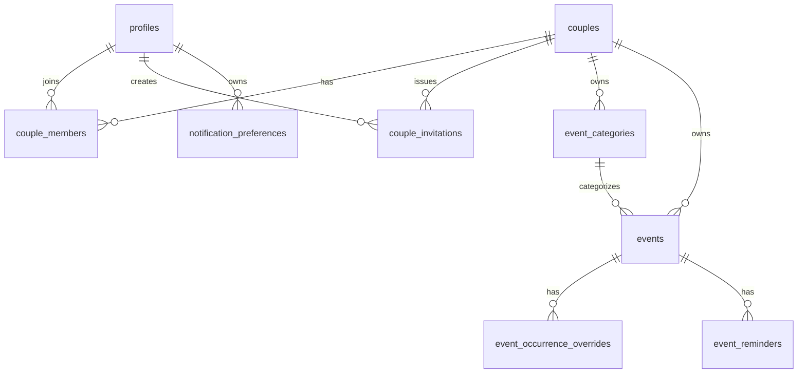

# CouplesCalendar Data Model

## Purpose

This document defines the PostgreSQL and Supabase data model required for Phase 1. It is a design
contract only. Milestone 1 does not create migrations, database tables, Supabase projects, policies,
or runtime data-access code.

## Design Principles

- Supabase PostgreSQL is the authoritative data store.
- Row Level Security is the authoritative data-isolation boundary.
- Every couple-scoped record is owned by exactly one `couple_id`.
- A user can belong to only one active couple workspace in Phase 1.
- A couple can have at most two active members.
- Invitation acceptance is atomic and protected against concurrent over-acceptance.
- Time, timezone, recurrence, and all-day semantics are explicit and consistent.
- Client-side filtering is never treated as a security control.

## Entity Relationship Overview

## Shared Types and Conventions

Later migrations should use check constraints or PostgreSQL enum types for status fields. Check
constraints are preferred until the schema stabilizes because they are easier to evolve.

Common status values:

- Couple status: `active`, `deleted`.
- Membership status: `active`, `exited`, `removed`.
- Invitation status: `pending`, `accepted`, `revoked`.
- Event status: `active`, `deleted`.
- Event time kind: `all_day`, `timed`.
- Occurrence override status: `active`, `cancelled`.
- Reminder channel: `in_app`, `browser`.

Timestamp columns use `timestamptz`. Primary keys use `uuid`. Date-only all-day fields use `date`.
Timezone names use IANA timezone identifiers stored as `text` and validated by shared application
validation before write.

## Tables

### `profiles`

Purpose: one application profile per authenticated Supabase Auth user.

| Column             | Type          | Null | Default | Notes                                                          |
| ------------------ | ------------- | ---- | ------- | -------------------------------------------------------------- |
| `id`               | `uuid`        | no   | none    | Primary key; references `auth.users(id)` on delete cascade.    |
| `display_name`     | `text`        | no   | none    | Required minimum profile field; trim and check length 1 to 80. |
| `default_timezone` | `text`        | no   | none    | IANA timezone selected during profile setup.                   |
| `created_at`       | `timestamptz` | no   | `now()` | Creation timestamp.                                            |
| `updated_at`       | `timestamptz` | no   | `now()` | Updated by trigger.                                            |

Constraints and indexes:

- Primary key: `profiles(id)`.
- Foreign key: `profiles.id -> auth.users.id`.
- Check: `length(trim(display_name)) between 1 and 80`.
- Index: primary key is sufficient for Phase 1.

Deletion behavior:

- Deleting an auth user cascades to the profile.
- Membership exit and notification cleanup must be handled before or during account deletion.

Owning boundary:

- User-scoped by `id`.

Expected RLS:

- A user may select, insert, and update only their own profile.
- Users cannot delete profiles directly through the client; account deletion uses an approved flow.

### `couples`

Purpose: one private workspace and shared calendar for a couple.

| Column       | Type          | Null | Default             | Notes                                      |
| ------------ | ------------- | ---- | ------------------- | ------------------------------------------ |
| `id`         | `uuid`        | no   | `gen_random_uuid()` | Primary key.                               |
| `name`       | `text`        | no   | none                | Couple display name; check length 1 to 80. |
| `created_by` | `uuid`        | no   | none                | References `profiles(id)`.                 |
| `status`     | `text`        | no   | `'active'`          | Check `active` or `deleted`.               |
| `deleted_at` | `timestamptz` | yes  | none                | Set when deleted.                          |
| `created_at` | `timestamptz` | no   | `now()`             | Creation timestamp.                        |
| `updated_at` | `timestamptz` | no   | `now()`             | Updated by trigger.                        |

Constraints and indexes:

- Primary key: `couples(id)`.
- Foreign key: `created_by -> profiles(id)`.
- Check: `length(trim(name)) between 1 and 80`.
- Check: `status in ('active', 'deleted')`.
- Check: `deleted_at is not null` when `status = 'deleted'`.
- Index: `(status)`.

Deletion behavior:

- Couple deletion marks the couple deleted and removes or soft-deletes dependent calendar records
  according to final migration design.
- Normal reads exclude deleted couples.

Owning boundary:

- Couple-scoped by `id`.

Expected RLS:

- Active members may select their active couple.
- Active members may update basic couple settings.
- Direct client insert is allowed only through a controlled create-couple operation that also inserts
  the first membership in one transaction.
- Direct client delete is not allowed; deletion uses an approved flow.

### `couple_members`

Purpose: membership records connecting profiles to couples.

| Column               | Type          | Null | Default             | Notes                                                     |
| -------------------- | ------------- | ---- | ------------------- | --------------------------------------------------------- |
| `id`                 | `uuid`        | no   | `gen_random_uuid()` | Primary key.                                              |
| `couple_id`          | `uuid`        | no   | none                | References `couples(id)` on delete cascade.               |
| `user_id`            | `uuid`        | no   | none                | References `profiles(id)` on delete cascade.              |
| `role`               | `text`        | no   | `'member'`          | Phase 1 uses only `member`.                               |
| `membership_status`  | `text`        | no   | `'active'`          | Check `active`, `exited`, or `removed`.                   |
| `active_member_slot` | `smallint`    | yes  | none                | `1` or `2` for active members; null for inactive records. |
| `joined_at`          | `timestamptz` | no   | `now()`             | Acceptance or creation timestamp.                         |
| `left_at`            | `timestamptz` | yes  | none                | Set when no longer active.                                |
| `created_at`         | `timestamptz` | no   | `now()`             | Creation timestamp.                                       |
| `updated_at`         | `timestamptz` | no   | `now()`             | Updated by trigger.                                       |

Constraints and indexes:

- Primary key: `couple_members(id)`.
- Foreign keys: `couple_id -> couples(id)`, `user_id -> profiles(id)`.
- Unique: `(couple_id, user_id)`.
- Partial unique: one active couple per user: `(user_id) where membership_status = 'active'`.
- Partial unique: one active occupant per couple slot:
  `(couple_id, active_member_slot) where membership_status = 'active'`.
- Check: `role = 'member'`.
- Check: `membership_status in ('active', 'exited', 'removed')`.
- Check: `active_member_slot in (1, 2)` when status is active.
- Check: `active_member_slot is null` when status is not active.
- Check: `left_at is null` when status is active.
- Index: `(couple_id, membership_status)`.
- Index: `(user_id, membership_status)`.

Two-member enforcement:

- The invitation acceptance transaction locks the target couple row, counts active members, assigns
  slot `1` or `2`, and rejects the operation when two active members already exist.
- The partial unique slot index prevents two concurrent transactions from occupying the same active
  slot.
- The partial unique active-user index prevents a user from joining more than one active couple.

Deletion behavior:

- Couple deletion cascades or soft-deletes membership records according to final deletion policy.
- Account deletion cascades the user's profile and deactivates or removes their membership through an
  approved flow.

Owning boundary:

- Couple-scoped and user-linked.

Expected RLS:

- Active members can select active membership rows for their couple.
- A user can select their own inactive historical rows where needed for account state.
- Inserts and status transitions are restricted to controlled create, accept, exit, or delete flows.

### `couple_invitations`

Purpose: one-time invitation records for adding the second member to a couple.

| Column        | Type          | Null | Default             | Notes                                                             |
| ------------- | ------------- | ---- | ------------------- | ----------------------------------------------------------------- |
| `id`          | `uuid`        | no   | `gen_random_uuid()` | Primary key.                                                      |
| `couple_id`   | `uuid`        | no   | none                | References `couples(id)` on delete cascade.                       |
| `created_by`  | `uuid`        | no   | none                | References `profiles(id)`.                                        |
| `token_hash`  | `text`        | no   | none                | Hash of random invitation token; plaintext token is never stored. |
| `status`      | `text`        | no   | `'pending'`         | Check `pending`, `accepted`, or `revoked`.                        |
| `expires_at`  | `timestamptz` | no   | none                | Expiration timestamp.                                             |
| `revoked_at`  | `timestamptz` | yes  | none                | Set when revoked.                                                 |
| `accepted_by` | `uuid`        | yes  | none                | References `profiles(id)`.                                        |
| `accepted_at` | `timestamptz` | yes  | none                | Set when accepted.                                                |
| `created_at`  | `timestamptz` | no   | `now()`             | Creation timestamp.                                               |
| `updated_at`  | `timestamptz` | no   | `now()`             | Updated by trigger.                                               |

Constraints and indexes:

- Primary key: `couple_invitations(id)`.
- Foreign keys: `couple_id -> couples(id)`, `created_by -> profiles(id)`,
  `accepted_by -> profiles(id)`.
- Unique: `token_hash`.
- Partial index: `(couple_id) where status = 'pending'`.
- Index: `(expires_at) where status = 'pending'`.
- Check: `status in ('pending', 'accepted', 'revoked')`.
- Check: `expires_at > created_at`.
- Check: accepted invitations have both `accepted_by` and `accepted_at`.
- Check: revoked invitations have `revoked_at`.
- Check: pending invitations have null `accepted_by`, `accepted_at`, and `revoked_at`.

Deletion behavior:

- Couple deletion cascades invitation records.
- Revocation changes status and preserves audit timestamps.

Owning boundary:

- Couple-scoped by `couple_id`.
- Secret acceptance boundary is the token, but table reads are not granted by token.

Expected RLS:

- Active members can select and revoke invitations for their own couple.
- Recipients do not receive direct table read access by token. They call an atomic acceptance RPC with
  the plaintext token.
- Accepted users may see the invitation only after becoming active members or as `accepted_by` if
  needed for confirmation.

### `event_categories`

Purpose: couple-owned color categories for organizing events.

| Column       | Type          | Null | Default             | Notes                                       |
| ------------ | ------------- | ---- | ------------------- | ------------------------------------------- |
| `id`         | `uuid`        | no   | `gen_random_uuid()` | Primary key.                                |
| `couple_id`  | `uuid`        | no   | none                | References `couples(id)` on delete cascade. |
| `name`       | `text`        | no   | none                | Display name, length 1 to 40.               |
| `color`      | `text`        | no   | none                | Validated hex color such as `#2f6fed`.      |
| `sort_order` | `integer`     | no   | `0`                 | User-facing ordering.                       |
| `created_by` | `uuid`        | no   | none                | References `profiles(id)`.                  |
| `created_at` | `timestamptz` | no   | `now()`             | Creation timestamp.                         |
| `updated_at` | `timestamptz` | no   | `now()`             | Updated by trigger.                         |

Constraints and indexes:

- Primary key: `event_categories(id)`.
- Foreign keys: `couple_id -> couples(id)`, `created_by -> profiles(id)`.
- Unique: `(couple_id, lower(name))`.
- Check: `length(trim(name)) between 1 and 40`.
- Check: `color` matches approved hex color format.
- Index: `(couple_id, sort_order)`.

Deletion behavior:

- Deleting a category sets referencing events' `category_id` to null or requires category
  reassignment. The safer Phase 1 default is `on delete set null`.

Owning boundary:

- Couple-scoped by `couple_id`.

Expected RLS:

- Active members can select and manage categories for their couple only.

### `events`

Purpose: base event and recurring-series records for the shared calendar.

| Column               | Type          | Null | Default             | Notes                                                    |
| -------------------- | ------------- | ---- | ------------------- | -------------------------------------------------------- |
| `id`                 | `uuid`        | no   | `gen_random_uuid()` | Primary key.                                             |
| `couple_id`          | `uuid`        | no   | none                | References `couples(id)` on delete cascade.              |
| `category_id`        | `uuid`        | yes  | none                | References `event_categories(id)` on delete set null.    |
| `created_by`         | `uuid`        | no   | none                | References `profiles(id)`.                               |
| `updated_by`         | `uuid`        | yes  | none                | References `profiles(id)`.                               |
| `title`              | `text`        | no   | none                | Length 1 to 120.                                         |
| `description`        | `text`        | yes  | none                | Optional details.                                        |
| `location`           | `text`        | yes  | none                | Optional location.                                       |
| `time_kind`          | `text`        | no   | none                | `all_day` or `timed`.                                    |
| `start_date`         | `date`        | yes  | none                | Required for all-day events.                             |
| `end_date`           | `date`        | yes  | none                | Exclusive end date for all-day events.                   |
| `starts_at`          | `timestamptz` | yes  | none                | Required for timed events; stored UTC instant.           |
| `ends_at`            | `timestamptz` | yes  | none                | Required for timed events; stored UTC instant.           |
| `timezone`           | `text`        | no   | none                | IANA timezone for timed events and recurrence anchoring. |
| `recurrence_rule`    | `text`        | yes  | none                | RFC 5545-style RRULE without `DTSTART`.                  |
| `recurrence_ends_at` | `timestamptz` | yes  | none                | Optional query helper derived from rule end condition.   |
| `status`             | `text`        | no   | `'active'`          | `active` or `deleted`.                                   |
| `version`            | `integer`     | no   | `1`                 | Optimistic concurrency version.                          |
| `deleted_at`         | `timestamptz` | yes  | none                | Set when deleted.                                        |
| `created_at`         | `timestamptz` | no   | `now()`             | Creation timestamp.                                      |
| `updated_at`         | `timestamptz` | no   | `now()`             | Updated by trigger.                                      |

Constraints and indexes:

- Primary key: `events(id)`.
- Foreign keys: `couple_id -> couples(id)`, `category_id -> event_categories(id)`,
  `created_by -> profiles(id)`, `updated_by -> profiles(id)`.
- Check: `length(trim(title)) between 1 and 120`.
- Check: `time_kind in ('all_day', 'timed')`.
- Check for all-day events:
  - `start_date is not null`.
  - `end_date is not null`.
  - `end_date >= start_date`.
  - `starts_at is null`.
  - `ends_at is null`.
- Check for timed events:
  - `starts_at is not null`.
  - `ends_at is not null`.
  - `ends_at >= starts_at`.
  - `start_date is null`.
  - `end_date is null`.
- Check: `timezone` is non-empty; application validation confirms it is a valid IANA timezone.
- Check: `status in ('active', 'deleted')`.
- Check: `version > 0`.
- Composite foreign key or trigger: `category_id` must belong to the same `couple_id` as the event.
- Index: `(couple_id, status, starts_at)` for timed event range reads.
- Index: `(couple_id, status, start_date)` for all-day event range reads.
- Index: `(couple_id, status, updated_at)` for synchronization.
- Index: `(couple_id, category_id)` for filters.
- Search index: later milestone may add a text-search index over title, location, and description.

Deletion behavior:

- Normal delete is soft delete by setting `status = 'deleted'` and `deleted_at`.
- Couple deletion cascades or removes associated events according to final retention policy.

Owning boundary:

- Couple-scoped by `couple_id`.

Expected RLS:

- Active members can select, insert, update, and soft-delete active events for their couple.
- Updates require conflict-aware predicates using `version` or `updated_at`.
- Category and reminder references must remain within the same couple.

### `event_occurrence_overrides`

Purpose: cancellations and overrides for individual occurrences of a recurring event.

| Column                          | Type          | Null | Default             | Notes                                             |
| ------------------------------- | ------------- | ---- | ------------------- | ------------------------------------------------- |
| `id`                            | `uuid`        | no   | `gen_random_uuid()` | Primary key.                                      |
| `couple_id`                     | `uuid`        | no   | none                | References `couples(id)` on delete cascade.       |
| `event_id`                      | `uuid`        | no   | none                | References `events(id)` on delete cascade.        |
| `original_occurrence_starts_at` | `timestamptz` | no   | none                | UTC instant identifying the generated occurrence. |
| `override_status`               | `text`        | no   | `'active'`          | `active` or `cancelled`.                          |
| `title`                         | `text`        | yes  | none                | Override title, if changed.                       |
| `description`                   | `text`        | yes  | none                | Override description, if changed.                 |
| `location`                      | `text`        | yes  | none                | Override location, if changed.                    |
| `category_id`                   | `uuid`        | yes  | none                | Override category, if changed.                    |
| `time_kind`                     | `text`        | yes  | none                | Optional override of all-day or timed.            |
| `start_date`                    | `date`        | yes  | none                | Override all-day start date.                      |
| `end_date`                      | `date`        | yes  | none                | Override all-day exclusive end date.              |
| `starts_at`                     | `timestamptz` | yes  | none                | Override timed start.                             |
| `ends_at`                       | `timestamptz` | yes  | none                | Override timed end.                               |
| `timezone`                      | `text`        | yes  | none                | Override timezone, if changed.                    |
| `created_by`                    | `uuid`        | no   | none                | References `profiles(id)`.                        |
| `updated_by`                    | `uuid`        | yes  | none                | References `profiles(id)`.                        |
| `version`                       | `integer`     | no   | `1`                 | Optimistic concurrency version.                   |
| `created_at`                    | `timestamptz` | no   | `now()`             | Creation timestamp.                               |
| `updated_at`                    | `timestamptz` | no   | `now()`             | Updated by trigger.                               |

Constraints and indexes:

- Primary key: `event_occurrence_overrides(id)`.
- Foreign keys: `couple_id -> couples(id)`, `event_id -> events(id)`,
  `category_id -> event_categories(id)`, `created_by -> profiles(id)`,
  `updated_by -> profiles(id)`.
- Unique: `(event_id, original_occurrence_starts_at)`.
- Check: `override_status in ('active', 'cancelled')`.
- Check: active overrides follow the same time semantics as `events` when time fields are present.
- Check or trigger: override `couple_id` matches parent event `couple_id`.
- Check or trigger: override category belongs to the same couple.
- Index: `(couple_id, event_id)`.
- Index: `(couple_id, original_occurrence_starts_at)`.

Deletion behavior:

- Deleting the parent event deletes overrides.

Owning boundary:

- Couple-scoped by `couple_id`.

Expected RLS:

- Active members can manage overrides for recurring events in their couple only.

### `event_reminders`

Purpose: reminder configuration for events.

| Column           | Type          | Null | Default             | Notes                                                                          |
| ---------------- | ------------- | ---- | ------------------- | ------------------------------------------------------------------------------ |
| `id`             | `uuid`        | no   | `gen_random_uuid()` | Primary key.                                                                   |
| `couple_id`      | `uuid`        | no   | none                | References `couples(id)` on delete cascade.                                    |
| `event_id`       | `uuid`        | no   | none                | References `events(id)` on delete cascade.                                     |
| `user_id`        | `uuid`        | yes  | none                | Null means reminder applies to both active members; non-null targets one user. |
| `minutes_before` | `integer`     | no   | none                | Non-negative offset before event start.                                        |
| `channel`        | `text`        | no   | `'in_app'`          | `in_app` or `browser`.                                                         |
| `created_at`     | `timestamptz` | no   | `now()`             | Creation timestamp.                                                            |
| `updated_at`     | `timestamptz` | no   | `now()`             | Updated by trigger.                                                            |

Constraints and indexes:

- Primary key: `event_reminders(id)`.
- Foreign keys: `couple_id -> couples(id)`, `event_id -> events(id)`, `user_id -> profiles(id)`.
- Check: `minutes_before >= 0`.
- Check: `channel in ('in_app', 'browser')`.
- Check or trigger: reminder `couple_id` matches event `couple_id`.
- Check or trigger: targeted `user_id` is an active member of the same couple.
- Unique: `(event_id, user_id, minutes_before, channel)` with null handling implemented explicitly.
- Index: `(couple_id, event_id)`.
- Index: `(user_id) where user_id is not null`.

Deletion behavior:

- Deleting an event deletes its reminders.
- Account deletion removes targeted reminders for that user or converts shared reminders according to
  final implementation policy.

Owning boundary:

- Couple-scoped by `couple_id`; optionally user-targeted by `user_id`.

Expected RLS:

- Active members can select reminders for events in their couple.
- Active members can manage shared reminders.
- A user can manage reminders targeted to themselves.
- A user cannot target a reminder to someone outside the couple.

### `notification_preferences`

Purpose: per-user notification behavior.

| Column                          | Type          | Null | Default             | Notes                                              |
| ------------------------------- | ------------- | ---- | ------------------- | -------------------------------------------------- |
| `id`                            | `uuid`        | no   | `gen_random_uuid()` | Primary key.                                       |
| `user_id`                       | `uuid`        | no   | none                | References `profiles(id)` on delete cascade.       |
| `default_reminder_minutes`      | `integer`     | yes  | `30`                | Null means no default reminder.                    |
| `browser_notifications_enabled` | `boolean`     | no   | `false`             | User preference, separate from browser permission. |
| `quiet_hours_start`             | `time`        | yes  | none                | Optional local quiet-hours start.                  |
| `quiet_hours_end`               | `time`        | yes  | none                | Optional local quiet-hours end.                    |
| `timezone`                      | `text`        | no   | none                | IANA timezone for preference interpretation.       |
| `created_at`                    | `timestamptz` | no   | `now()`             | Creation timestamp.                                |
| `updated_at`                    | `timestamptz` | no   | `now()`             | Updated by trigger.                                |

Constraints and indexes:

- Primary key: `notification_preferences(id)`.
- Foreign key: `user_id -> profiles(id)`.
- Unique: `(user_id)`.
- Check: `default_reminder_minutes is null or default_reminder_minutes >= 0`.
- Check: quiet-hours fields are both null or both non-null.
- Index: unique `user_id` is sufficient for Phase 1.

Deletion behavior:

- Deleting a profile deletes notification preferences.

Owning boundary:

- User-scoped by `user_id`.

Expected RLS:

- Users can select, insert, update, and delete only their own notification preferences.

## Recurrence Model

### Representation

- Recurring series are stored in `events`.
- `recurrence_rule` stores an RFC 5545-style `RRULE` string without `DTSTART`.
- The series start comes from the event's all-day `start_date` or timed `starts_at`.
- The series timezone is `events.timezone`.
- End conditions are represented in the RRULE through `COUNT` or `UNTIL`, with
  `recurrence_ends_at` available as a query helper when useful.
- Open-ended series are allowed but expansion must be bounded by the visible query range.

### Occurrence Identity

- Each generated occurrence is identified by `event_id` plus the original occurrence start instant.
- For all-day recurrence, the original occurrence start is interpreted at local midnight in the
  series timezone and converted to UTC for `original_occurrence_starts_at`.
- `event_occurrence_overrides` stores one row per changed or cancelled occurrence.

### Editing and Deleting

- Edit one occurrence: create or update an `event_occurrence_overrides` row with changed fields.
- Delete one occurrence: create or update an override with `override_status = 'cancelled'`.
- Edit entire series: update the parent `events` row and keep compatible overrides when they still
  identify generated occurrences.
- Delete entire series: soft-delete the parent `events` row; overrides are hidden or cascaded.
- Edit this and future occurrences: documented as a possible Phase 1 behavior, but implementation may
  defer it unless it can be supported without corrupting the series. The safe model is to end the
  original series before the selected occurrence and create a new series for future occurrences.

### Query and Expansion Boundaries

- Calendar queries request events whose base schedule or recurrence can intersect the visible range.
- Expansion is bounded by the requested range plus a small buffer needed by the UI.
- Infinite recurrence is never expanded without a range bound.
- FullCalendar receives normalized occurrence objects with:
  - Stable occurrence ID.
  - Parent event ID.
  - Title.
  - Start and end.
  - All-day flag.
  - Timezone context.
  - Category color.
  - Override or cancellation state.

## Date and Time Semantics

### All-Day Events

- All-day events use `start_date` and `end_date`.
- `end_date` is exclusive.
- A one-day event on 2026-08-04 stores `start_date = 2026-08-04` and `end_date = 2026-08-05`.
- All-day display is date-based and not shifted by viewer timezone.
- All-day recurrence is anchored to local dates in the event timezone.

### Timed Events

- Timed events use `starts_at` and `ends_at` as UTC instants.
- `timezone` stores the IANA timezone selected for the event.
- The UI displays local wall time using the event timezone and viewer preferences.
- Timed recurrence is anchored to local wall time in the event timezone and converted to UTC for each
  occurrence.

## RLS Matrix

Legend:

- `No`: operation is denied.
- `Own`: operation allowed only for the user's own row.
- `Member`: operation allowed only when the user is an active member of the record's couple.
- `Creator`: operation allowed for the active member who created the invitation.
- `Recipient RPC`: recipient may act only through the atomic invitation acceptance RPC, not direct
  table access.
- `Controlled`: operation allowed only through a transaction-safe function or approved flow.

| Table                        | Actor                        | SELECT                                         | INSERT                                   | UPDATE                        | DELETE                 |
| ---------------------------- | ---------------------------- | ---------------------------------------------- | ---------------------------------------- | ----------------------------- | ---------------------- |
| `profiles`                   | Unauthenticated              | No                                             | No                                       | No                            | No                     |
| `profiles`                   | Authenticated without couple | Own                                            | Own                                      | Own                           | No                     |
| `profiles`                   | Active couple member         | Own; partner minimal profile via membership UI | Own                                      | Own                           | No                     |
| `profiles`                   | Invitation creator           | Own                                            | Own                                      | Own                           | No                     |
| `profiles`                   | Invitation recipient         | Own after auth                                 | Own                                      | Own                           | No                     |
| `profiles`                   | Preference owner             | Own                                            | Own                                      | Own                           | No                     |
| `couples`                    | Unauthenticated              | No                                             | No                                       | No                            | No                     |
| `couples`                    | Authenticated without couple | No                                             | Controlled create-couple flow            | No                            | No                     |
| `couples`                    | Active couple member         | Member                                         | No                                       | Member                        | Controlled             |
| `couples`                    | Invitation creator           | Member                                         | No                                       | Member                        | Controlled             |
| `couples`                    | Invitation recipient         | No before acceptance                           | No                                       | No                            | No                     |
| `couple_members`             | Unauthenticated              | No                                             | No                                       | No                            | No                     |
| `couple_members`             | Authenticated without couple | Own inactive state if needed                   | Controlled                               | No                            | No                     |
| `couple_members`             | Active couple member         | Member                                         | No                                       | Controlled exit only          | No                     |
| `couple_members`             | Invitation creator           | Member                                         | No                                       | Controlled                    | No                     |
| `couple_members`             | Invitation recipient         | Recipient RPC                                  | Recipient RPC                            | No                            | No                     |
| `couple_invitations`         | Unauthenticated              | No                                             | No                                       | No                            | No                     |
| `couple_invitations`         | Authenticated without couple | No                                             | No                                       | No                            | No                     |
| `couple_invitations`         | Active couple member         | Member                                         | Member when couple has one active member | Member revoke pending         | No                     |
| `couple_invitations`         | Invitation creator           | Creator                                        | Creator                                  | Creator revoke pending        | No                     |
| `couple_invitations`         | Invitation recipient         | Recipient RPC                                  | No                                       | Recipient RPC accept          | No                     |
| `event_categories`           | Unauthenticated              | No                                             | No                                       | No                            | No                     |
| `event_categories`           | Authenticated without couple | No                                             | No                                       | No                            | No                     |
| `event_categories`           | Active couple member         | Member                                         | Member                                   | Member                        | Member                 |
| `events`                     | Unauthenticated              | No                                             | No                                       | No                            | No                     |
| `events`                     | Authenticated without couple | No                                             | No                                       | No                            | No                     |
| `events`                     | Active couple member         | Member                                         | Member                                   | Member with concurrency check | Controlled soft delete |
| `event_occurrence_overrides` | Unauthenticated              | No                                             | No                                       | No                            | No                     |
| `event_occurrence_overrides` | Authenticated without couple | No                                             | No                                       | No                            | No                     |
| `event_occurrence_overrides` | Active couple member         | Member                                         | Member                                   | Member with concurrency check | Member                 |
| `event_reminders`            | Unauthenticated              | No                                             | No                                       | No                            | No                     |
| `event_reminders`            | Authenticated without couple | No                                             | No                                       | No                            | No                     |
| `event_reminders`            | Active couple member         | Member                                         | Member                                   | Member                        | Member                 |
| `event_reminders`            | Preference owner             | Member when event is in active couple          | Own target                               | Own target                    | Own target             |
| `notification_preferences`   | Unauthenticated              | No                                             | No                                       | No                            | No                     |
| `notification_preferences`   | Authenticated without couple | Own                                            | Own                                      | Own                           | Own                    |
| `notification_preferences`   | Active couple member         | Own                                            | Own                                      | Own                           | Own                    |
| `notification_preferences`   | Preference owner             | Own                                            | Own                                      | Own                           | Own                    |

## Required Invariants

- A couple has at most two active members.
- A user has at most one active couple membership.
- Invitation acceptance cannot bypass the member limit under concurrency.
- Invitation tokens are one-time, expiring, revocable, and stored only as hashes.
- A user cannot read or modify another couple's records.
- Every event belongs to exactly one couple.
- Category ownership cannot cross couple boundaries.
- Reminder ownership and notification preferences cannot cross user or couple boundaries.
- Event end cannot precede event start.
- All-day events use date-only exclusive-end semantics.
- Timed events use UTC instants plus IANA timezone context.
- Recurrence expansion is deterministic and bounded.
- One occurrence can be changed or cancelled without corrupting the series.
- Delete and cascade behavior cannot expose or orphan protected data.
