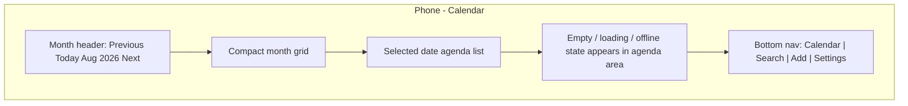
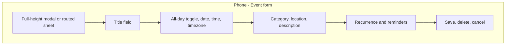
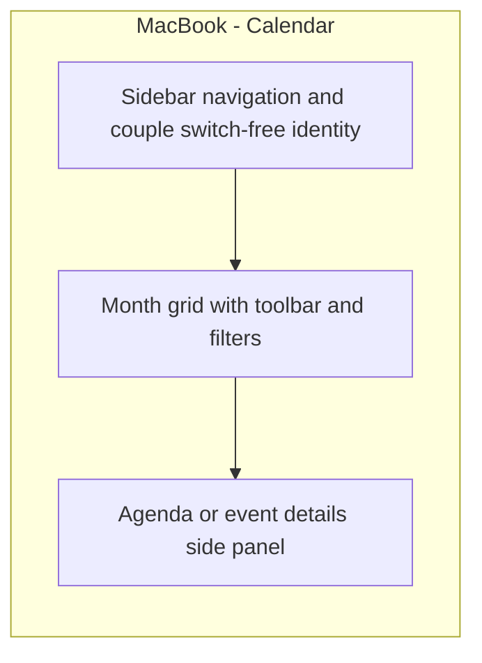
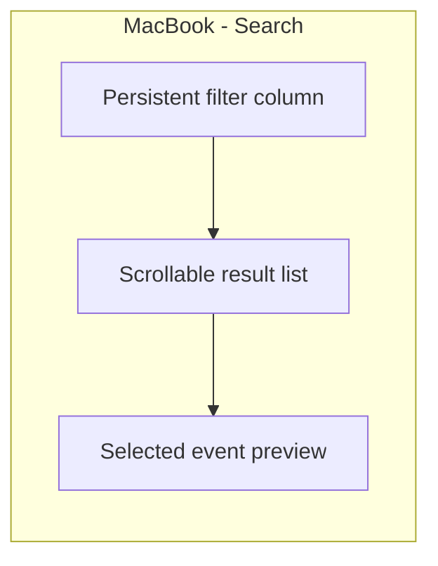

# CouplesCalendar Product Specification

## Purpose

CouplesCalendar is a private, mobile-first shared-calendar progressive web application for exactly
two authenticated users. Phase 1 establishes one shared calendar for one couple workspace, with
complete phone usability and a fully functional MacBook layout.

This document is the authoritative Phase 1 product contract. Later milestones must implement this
contract unless the owner approves a formal amendment.

## Product Identity

- Product: `CouplesCalendar`
- Repository: `bmsmithtx-svg/CouplesCalendar`
- Repository URL: `https://github.com/bmsmithtx-svg/CouplesCalendar`
- Canonical local path: `/Users/bmsm1th/Documents/CouplesCalendar`
- Phase: Phase 1
- Current authorized milestone: Milestone 1 - Product Contract, UX, Architecture, and Data Design

## Product Principles

- CouplesCalendar is a private shared calendar for a couple.
- A couple workspace has exactly two authenticated users when fully active.
- A user may belong to only one active couple workspace in Phase 1. This keeps the product aligned
  with the exactly-two-user contract and avoids account switching, membership ambiguity, and
  cross-couple data exposure.
- The couple has one shared calendar rather than multiple independent calendars.
- Shared calendar information is the couple's common source of truth.
- The interface is calm, trustworthy, simple, and legible.
- The product is optimized first for phones while remaining fully usable on a MacBook.
- System complexity is deliberately limited without removing planned user-facing Phase 1
  functionality.
- Client-side filtering improves usability but is never a security boundary.

## Phase 1 Functional Scope

Phase 1 must provide the following user-facing capabilities when all milestones are complete.

### Accounts and Profiles

- Users can sign up, sign in, sign out, and resume a session through Supabase Auth.
- Each authenticated user has one `profiles` record.
- The minimum required profile fields are display name and created timezone.
- Email is owned by Supabase Auth and displayed only where needed for account identification.
- A user cannot create calendar data until the minimum profile is complete and the user belongs to a
  couple workspace.

### Couple Creation and Membership

- An authenticated user with a complete profile and no active couple can create one couple
  workspace.
- The creating user becomes the first active member.
- A couple can have at most two active members.
- A user can belong to at most one active couple.
- Couple membership is database-enforced and not dependent on client logic.
- Couple settings show the couple name, the two membership slots, invitation state, and safe exit or
  deletion options.

### Invitations

- The first member can create a secure one-time invitation link.
- Invitation links expire and can be revoked before acceptance.
- Invitation acceptance requires an authenticated user with a complete profile.
- Acceptance is atomic and cannot exceed the two-member cap, even under concurrent attempts.
- Accepted, expired, revoked, duplicate, reused, malformed, or already-full invitations are rejected
  safely with clear screens.
- Invitation tokens are treated as secrets. Only hashes are stored by the database.

### Calendar Viewing

- The primary screen is the shared calendar.
- Phones show a compact month surface paired with an agenda-oriented list for the selected date or
  range.
- MacBook layouts use available width intentionally: date navigation and filters remain accessible,
  the calendar grid occupies the primary area, and agenda/details can appear alongside it.
- Users can navigate by month, jump to today, select dates, and open event details.
- Loading, empty, offline, reconnecting, permission-denied, and failure states are explicit.

### Events

- Active couple members can create, view, edit, and delete events in their couple workspace.
- Events support:
  - Title.
  - All-day or timed scheduling.
  - Start and end date or time.
  - IANA timezone for timed events and recurrence anchoring.
  - Location.
  - Description.
  - Category.
  - Reminder settings.
  - Recurrence.
- All-day events use date-only semantics with an exclusive end date.
- Timed events are stored as UTC instants plus the user-selected IANA timezone.
- Event end cannot precede event start.
- Deleted events are not visible in normal calendar views.

### Recurring Events

- Recurring events use deterministic RFC 5545-style recurrence rules.
- Users can create recurring series with a start, timezone, frequency, interval, and end condition.
- Users can edit or delete:
  - One occurrence.
  - The entire recurring series.
- Phase 1 may document but does not need to implement "this and future occurrences" editing unless
  it remains simple and safe in the approved implementation milestone.
- Individual occurrence changes are represented as overrides or cancellations instead of mutating
  the base series destructively.
- FullCalendar receives normalized occurrences expanded for the visible range.

### Categories, Search, and Filters

- Each couple has event categories with name and color.
- Categories are scoped to one couple and cannot cross workspace boundaries.
- Users can filter by category, date range, all-day or timed status, recurrence, and reminders.
- Search matches event title, location, description, and category name within the user's active
  couple only.

### Realtime Collaboration and Conflict Handling

- Changes made by either member appear for the other member through Supabase Realtime.
- The UI prevents duplicate subscriptions for the same couple and visible range.
- Calendar data is re-fetched after reconnecting.
- Event editing is conflict-aware:
  - The edit form captures the event version or `updated_at` value at load time.
  - Save attempts include that concurrency value.
  - If the event changed meanwhile, the save is rejected and a conflict state is shown.
  - Users can review the latest authoritative event before retrying.
- Silent destructive overwrites are not acceptable.

### Reminders and Notifications

- Users can configure notification preferences for their own account.
- Event reminders are scoped to a couple event and may be assigned to one or both members according
  to documented reminder rules.
- Browser notification permission is requested only after user intent, not on first page load.
- SMS notifications are excluded from Phase 1.
- Reminder delivery in Phase 1 must not require a custom application server. Browser-local
  notifications may be used only where browser capability and installed PWA behavior make them
  reliable enough; otherwise reminders can be surfaced in-app until a later approved backend
  mechanism exists.

### PWA, Offline, and Reconnect Behavior

- The app is installable as a PWA in Phase 1.
- The installed application shell may load offline.
- Previously loaded calendar information may be displayed when safely cached.
- Offline or stale state must be visibly labeled.
- Network-dependent writes must not pretend to succeed while offline.
- Phase 1 does not include a complex persistent offline mutation queue or automatic distributed
  conflict merger.
- Reconnection triggers authoritative revalidation from Supabase.

### Settings

- Profile settings allow a user to update display name and default timezone.
- Couple settings allow members to view membership, manage invitation state, rename the couple, and
  perform safe exit or deletion actions.
- Notification settings are per-user.
- Settings screens must show loading, validation, permission, and failure states.

## User and Couple Lifecycle

1. A user signs up or signs in.
2. The user completes the minimum required profile.
3. The user either creates a couple workspace or accepts an invitation.
4. The first member creates a secure one-time invitation.
5. The second authenticated user opens the invitation link and accepts it.
6. Acceptance occurs in one database transaction and cannot exceed the two-member cap.
7. Both users receive access to the same private shared calendar.
8. Invitation expiration, revocation, reuse, duplicate acceptance, and already-full couple cases are
   rejected safely.
9. If a member exits:
   - Their `couple_members` record becomes inactive.
   - They lose access to the couple calendar immediately.
   - The remaining member keeps the calendar and may invite a replacement only if the owner approves
     that behavior in the implementation milestone. The simpler default is to allow the remaining
     active member to revoke open invitations and delete the couple.
10. If a couple is deleted:
    - Both members lose access.
    - Couple-scoped calendar data is deleted or soft-deleted according to the data retention policy
      documented in `docs/DATA_MODEL.md`.
11. If an account is deleted:
    - The user's membership is deactivated.
    - Their notification preferences are deleted.
    - Auth-owned credentials are removed through Supabase Auth.
    - Couple-scoped events remain available to the other active member unless couple deletion is also
      requested and authorized.

## Information Architecture

### Primary Navigation

Phones use bottom navigation with four destinations:

- Calendar.
- Search.
- Add event.
- Settings.

The Add action may be visually centered or elevated, but it remains a real navigation/action target
with a minimum 44 by 44 CSS pixel touch area and safe-area padding.

MacBook layouts use a left navigation rail or sidebar with:

- Calendar.
- Search and filters.
- Categories.
- Settings.

The main calendar surface remains the first screen after onboarding.

### Principal Screens

- Auth: sign in, sign up, password recovery where supported by Supabase Auth.
- Profile setup: minimum display name and timezone.
- Couple start: create workspace or accept invitation.
- Invitation management: create, copy, revoke, expire, accepted, invalid, already-full, and reused
  states.
- Calendar: month and agenda-oriented views.
- Event details: title, time, category, location, description, recurrence, reminders, metadata, edit
  and delete actions.
- Event form: create and edit presentation with validation and conflict states.
- Search and filters: query, category, date range, all-day/timed, recurring, reminder filters.
- Reminder settings: browser permission state, default reminder preferences, quiet/error states.
- Profile and couple settings: account, timezone, couple name, membership, invitations, exit, delete.

## Phone Wireframes

Phone expectations:

- Primary navigation sits at the bottom with safe-area padding.
- The event-creation action is reachable from the bottom nav and empty calendar states.
- The calendar header provides month navigation and a Today action.
- Tapping a date updates the agenda list; tapping an event opens details.
- Event creation and editing use a focused sheet or routed form that does not lose entered data on
  accidental background taps.
- Touch targets are at least 44 by 44 CSS pixels.
- Form controls avoid keyboard occlusion on small screens.

## MacBook Wireframes

MacBook expectations:

- The desktop layout is not a stretched phone view.
- Calendar navigation, filters, selected agenda, and event details can be visible together when space
  allows.
- Keyboard users can tab through navigation, calendar controls, forms, and dialogs in a predictable
  order.
- Dialogs and side panels are sized for reading and editing without horizontal scrolling.

## Interaction States

Every major workflow must explicitly handle:

- Loading.
- Empty.
- Validation error.
- Permission denied.
- Signed out.
- Profile incomplete.
- No couple.
- Invitation expired.
- Invitation revoked.
- Invitation already used.
- Couple already full.
- Offline.
- Reconnecting.
- Stale cached data.
- Save conflict.
- Network failure.
- Unexpected failure with redacted error text.

## Product Exclusions

The following are excluded from Phase 1:

- Google Calendar synchronization.
- Apple Calendar synchronization.
- Outlook Calendar synchronization.
- Importing or exporting external calendars.
- More than two members in one couple workspace.
- Teams, families, organizations, or public calendars.
- Multiple calendars per couple.
- Social feeds, comments, likes, gamification, or public profiles.
- Native iOS or Android applications.
- SMS notifications.
- Enterprise administration.
- AI-generated scheduling or calendar assistants.
- Payment processing or subscriptions.
- Complex offline write queues and distributed conflict resolution.

## Product Acceptance Criteria

| Workflow               | Acceptance criteria                                                                                                                   | Implementation milestone |
| ---------------------- | ------------------------------------------------------------------------------------------------------------------------------------- | ------------------------ |
| Repository foundation  | App renders the approved Milestone 0 foundation screen and validation is green.                                                       | 0                        |
| Product contract       | Product, architecture, data, security, and roadmap docs exist and are internally consistent.                                          | 1                        |
| App shell              | Mobile-first app shell, responsive layout primitives, and accessible navigation exist without calendar functionality.                 | 2                        |
| Authentication         | Users can sign up, sign in, sign out, resume sessions, and complete required profiles.                                                | 3                        |
| Couple creation        | Authenticated users with complete profiles can create one active couple workspace.                                                    | 4                        |
| Invitations            | One-time expiring invitations can be created, revoked, accepted atomically, and rejected safely when invalid.                         | 4                        |
| Two-member enforcement | The database prevents more than two active members and prevents one user from joining multiple active couples.                        | 4                        |
| Calendar viewing       | Active members can view the same private month and agenda-oriented calendar on phone and MacBook.                                     | 5                        |
| Event management       | Active members can create, view, edit, and delete all-day and timed events with timezone, location, description, and category fields. | 6                        |
| Recurrence             | Members can create recurring series and edit or delete one occurrence or the whole series.                                            | 7                        |
| Categories             | Members can manage couple-scoped categories and filter events by category.                                                            | 7                        |
| Search and filters     | Members can search and filter only within their active couple's calendar data.                                                        | 7                        |
| Realtime updates       | Partner changes appear without manual refresh while maintaining one active subscription per couple context.                           | 8                        |
| Conflict handling      | Saves detect stale edits and show a clear conflict state instead of overwriting silently.                                             | 8                        |
| Reminders              | Members can configure reminder and notification preferences within browser capability limits.                                         | 9                        |
| PWA                    | The app is installable and clearly distinguishes offline, stale, and reconnecting states.                                             | 9                        |
| Quality gate           | Accessibility, security review, validation scripts, and automated tests cover the implemented Phase 1 surface.                        | 10                       |
| Release                | Production deployment is validated without adding out-of-scope external calendar synchronization.                                     | 11                       |

## Scope Lock

Milestone 1 produces design contracts only. It does not implement authentication, Supabase
configuration, database migrations, routing, calendar views, event workflows, recurrence logic,
Realtime subscriptions, notification behavior, PWA service workers, deployment configuration, or
external calendar synchronization.
